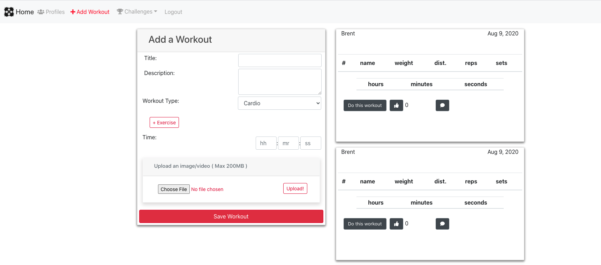
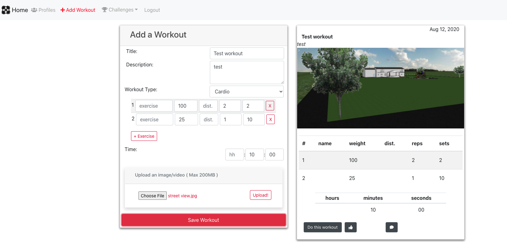

## User Story
With Covid and social Distancing measures in place, it became difficult to workout, many people rely on others for motivation to get to the gym each day
Our app directly engages friends in head to head exercise challenges, post photos and (eventually) videos of your accomplishments, and then challenge your friends 

## How to Use this Application
Setup an account and begin inputting exercise data, post to the feed, follow your friends in the profile tab, see their posts on your feed

## Contibutors 
- brentp24 [View Brent's Github](https://github.com/brentp24)
- scottmorr [View Scott's Github](https://github.com/scottmorr)
- ajhami [View Alex's Github](https://github.com/ajhami)
- Jahugawugasuga [View James' Github](https://github.com/jahugawugasuga)
---

## Links
- [View Github Repo Here](https://github.com/ajhami/exercise_wars) 
- [ View Deployed App Here](https://morning-cove-98782.herokuapp.com/) 
---

---

## Technology 
- HTML
- CSS
- Javascript
- FontAwesome
- Axios
- Proxy Middleware
- jQuery
- Moment
- React
- React Dom
- React Redux
- React Router Dom
- Redux Form
- Redux Thunk
- UUID
- AWS SDK
- BCrypt
- Body Parser
- Compression
- Concurrently
- CORS
- Dotenv Flow
- Dotenv
- Express
- Morgan
- Multer
- Multer S3
- Passport Local
- Path
- URL
- Mongoose
- AWS - S3
- JWT Simple
- JSON Web Token
---

## Future Development
- Additional Security Features
- Ability to Post and View Videos
- Upload Video's from Desktop and Mobile Devices
- Location Based Ability - Location Specific Challenges
- Push notifications 
- Music, visuals, transitions 
- Following, Comments, Like Functionality
- Profile picture upload
- Utilize Google/Facebook for login authentication
- PWA Integration

